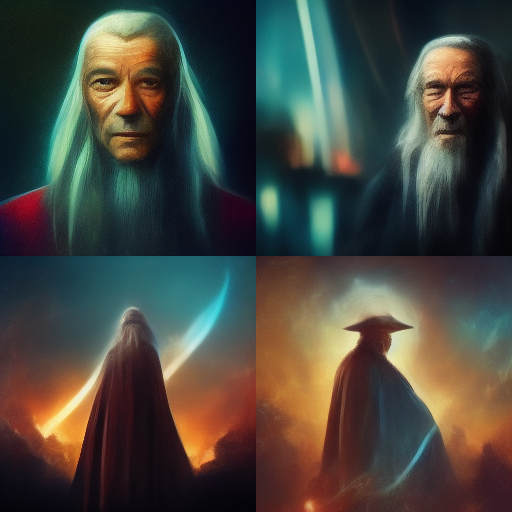
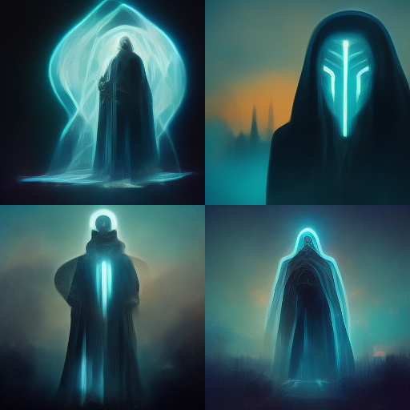
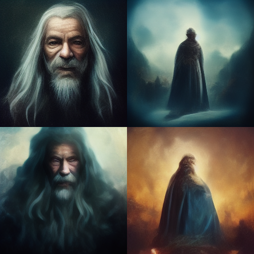
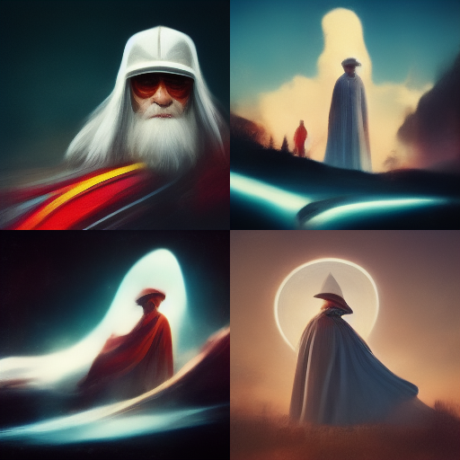
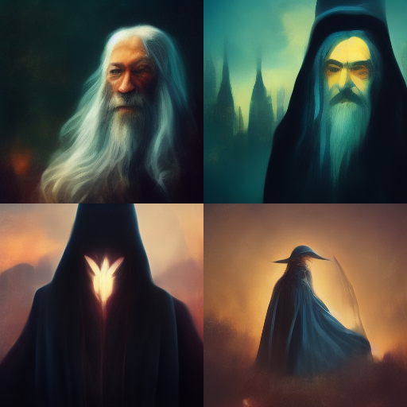
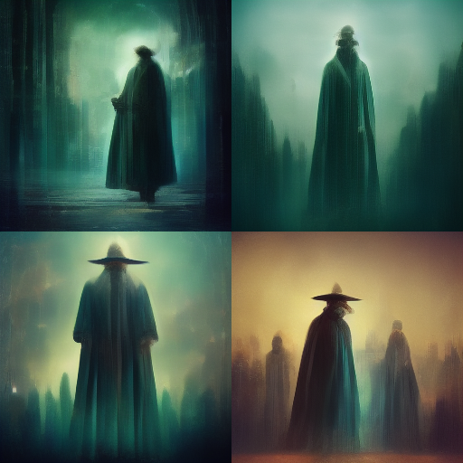
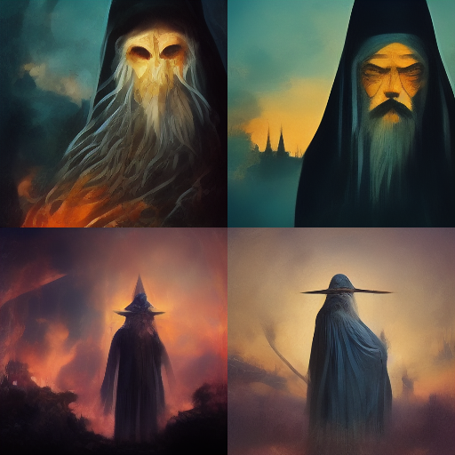
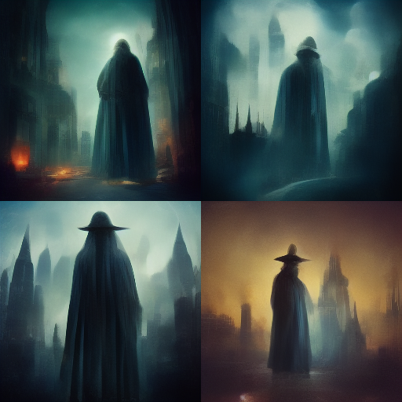

The prompts are in the following format:
> photo of Gandalf:: movie/show name:: --stop 70 --uplight --seed 2040

I don't believe --stop or --uplight affects initial generation, but are there for full disclosure.

|Movie|Gandalf|
|----:|-------|
|Reference||
|Star Wars||
|Star Trek||
|Tron||
|Game of Thrones||
|Speed Racer Movie||
|Fantasia||
|The Matrix||
|House of Flying Daggers||
|Dark City||

<!---
 Template
|||
--->
